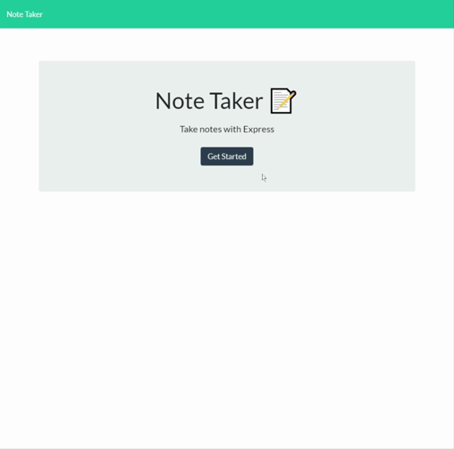

# HW11-Note-Taker

## Description-

- A note taker that can be used to write, save, and delete notes. This will help the user to keep track of all the information needed and allow user to have access to them when needed.

## Table of Contents
  1. [Technologies Used](#technologiesused)
  2. [Installation](#installation)
  3. [Gif Walkthrough](#gifwalkthrough)
  4. [Team HTML](#teamhtml)

## Technologies Used:

1. HTML
2. CSS
3. Javascript
4. Node
5. Heroku
6. ScreenToGif

## Installation:
```
npm express
npm uniqid
```

## Gif Walkthrough:


